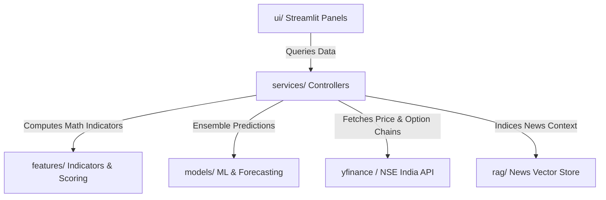

# 📈 AI Stock Assistant — Strategy & Indicators Walkthrough Guide

Welcome to the comprehensive walkthrough guide for the **AI Stock Assistant**. This document details the exact technical indicators, mathematical models, and trading strategies used across every page/option of the application.

---

## 🎯 System Architecture Overview

The system is designed as a **modular Streamlit dashboard** that separates the presentation layer (UI) from the analytics and data retrieval engine (Services & Features). 

---

## 📈 Detailed Breakdown by App Option

### 1. 📈 Stock Analysis Page
* **UI File**: [stock_analysis_page.py](file:///Users/nvvsnarayanadasari/StockMarket/FNO-Radar/ui/stock_analysis_page.py)
* **Backend File**: [analysis_service.py](file:///Users/nvvsnarayanadasari/StockMarket/FNO-Radar/services/analysis_service.py) & [prediction_models.py](file:///Users/nvvsnarayanadasari/StockMarket/FNO-Radar/models/prediction_models.py)

#### 🔍 Indicators Calculated:
* **EMA 20, SMA 20, SMA 50, SMA 200**: Used to identify overall trend alignment and support/resistance crossover signals.
* **RSI (14)**: Momentum oscillator indicating overbought (>70) or oversold (<30) thresholds.
* **MACD (12, 26, 9)**: Moving Average Convergence Divergence used to track trend acceleration and crossovers.
* **Average True Range (ATR 14)**: Measuring historical volatility to set stop-losses and price boundaries.
* **Bollinger Bands (20, 2)**: Tracking volatility compression (squeezes) and outer-band price breakouts.
* **5-Day Rolling VWAP**: The volume-weighted average price serving as a short-term anchor.

#### ⚙️ Strategy & Models:
1. **Trend Direction (ML Ensemble)**: The system feeds the calculated indicators into an ensemble of `RandomForestClassifier` and `GradientBoostingClassifier` trained on historical 5-day forward return labels. This ensemble predicts whether the next week's close will be **Bullish**, **Bearish**, or **Sideways**, along with a confidence probability.
2. **Price Range Projections**: Combines an ATR/Historical Volatility range formula with a Prophet time-series prediction model to estimate high and low target bounds for the next 5 sessions.
3. **AI Reasoning Explanation**: The technical scorecard, indicators, and recent news context fetched via the News RAG (retrieved from MoneyControl/ET RSS feeds using ChromaDB) are compiled and sent to the Llama 3.3 model via Groq. The model returns a 5-point portfolio verdict (Buy/Sell/Hold, allocation size, stop-loss target, and analytical reasoning).

---

### 2. ⚡ Intraday Scanner Page
* **UI File**: [intraday_scanner_page.py](file:///Users/nvvsnarayanadasari/StockMarket/FNO-Radar/ui/intraday_scanner_page.py)
* **Backend File**: [scanner_service.py](file:///Users/nvvsnarayanadasari/StockMarket/FNO-Radar/services/scanner_service.py)

#### 🔍 Indicators Calculated:
* **Price vs. VWAP**: Strong bullish bias if current price is above VWAP.
* **RSI Sweet Spot**: Check if RSI lies between 55 and 75 (momentum acceleration zone).
* **Volume Spike**: Volume of the current session is at least **1.5×** higher than its 20-day simple average.
* **MACD Histogram**: Positive acceleration check.
* **EMA 20 vs. SMA 50**: Crossover check.

#### ⚙️ Strategy:
* **Momentum Scanning**: Scans Nifty 50, 100, or 200 stocks and assigns an **Intraday Momentum Score (0-10 scale)** based on the criteria above. Stocks are ranked, and an ATR-based profit probability range is calculated.
* **Sector Rotation**: Compiles a 5-day average return grouped by industry sector to rank which sectors are currently attracting institutional money flow (gaining attention) vs. losing momentum (decreasing attention).

---

### 3. 📊 Advanced F&O Options Scanner Page
* **UI File**: [options_scanner_page.py](file:///Users/nvvsnarayanadasari/StockMarket/FNO-Radar/ui/options_scanner_page.py)
* **Backend File**: [options_service.py](file:///Users/nvvsnarayanadasari/StockMarket/FNO-Radar/services/options_service.py) & [put_options_service.py](file:///Users/nvvsnarayanadasari/StockMarket/FNO-Radar/services/put_options_service.py)

#### 🔍 Indicators & Pre-Filters (Hard Filters):
* **Trend Qualifier**: Price must be above its 20-day moving average.
* **Volume Expansion**: Session volume must be at least **1.2×** the 20-day average.
* **Volatility (ATR)**: `ATR / Close` must be $\ge 1.5\%$ to guarantee option liquidity and pricing movement.
* **Overextended Cap**: Price gain over the last 3 days must not exceed $8\%$ (to avoid chasing the top).
* **IV Rank Hard Filter**: Stocks with IV Rank > 75 are excluded from Call scans (prevents buying overpriced options that suffer IV crush).

#### ⚙️ Option Buying Strategy (7-Factor Scoring):
Qualifying stocks are ranked using a weighted 0-100 composite index:
* **A. Momentum (25% weight)**: Based on recent 5-day price changes.
* **B. Breakout (15% weight)**: **Graduated scale** — 100 points for confirmed breakout, 70 for within 1% of breakout, 40 for within 2.5%, 0 otherwise.
* **C. Volume Expansion (15% weight)**: Scaled ratio of current volume vs 20-day average.
* **D. OI Long Buildup (15% weight)**: **Real OI data** from NSE futures contract API. Scores based on OI change direction combined with price direction (Long Buildup: price↑ + OI↑ = high score; Short Covering: price↑ + OI↓ = medium; Short Buildup: price↓ + OI↑ = zero). Falls back to price+volume proxy if NSE data is unavailable.
* **E. RSI Sweet Spot (10% weight)**: Points given if RSI lies in the 45–65 accumulation zone.
* **F. IV Sweet Spot (10% weight)**: Incentivizes purchase when IV Rank is between 30–60.
* **G. Nifty Alignment (10% weight)**: 100 points if the Nifty 50 index is above its 20 DMA.
* *Bonus Relative Strength (+5 points)*: Awarded if the stock outpaces the Nifty 50 over 10 days.
* **Days-to-Expiry (DTE) Penalty**: Score adjusted based on proximity to expiry — ≤3 days: −15 pts, ≤7 days: −8 pts, >21 days: −3 pts.

#### 🎯 Smart Contract Selection:
Selects the target strike option based on market conditions:
* **Aggressive**: If Momentum Score > 75 and Vol Ratio > 1.8, select **OTM +1** (Out-of-the-Money) strike.
* **Conservative**: If IV Rank > 60, select **ITM -1** (In-the-Money) strike to protect against IV crush.
* **Balanced**: Otherwise, select **ATM** (At-the-Money) strike.

#### 🧮 Greeks Verification (Black-Scholes Engine):
* **Delta**: Must fall within the target $0.40\text{--}0.55$ range (optimal price delta).
* **Theta Decay**: Ensures daily theta loss is $\le 0.5\%$ of the option premium.
* **Risk/Reward**: Checks if `(Expected Price Move * Delta) / (Premium * 30% Stop-loss)` is $\ge 1.8$.

#### 🛡️ Risk Management & Advanced Setups:
* **Sector Diversification**: Max 2 stocks from the same sector allowed in Top-N results.
* **Corporate Action Warning**: Automatically flags if the stock has an upcoming Earnings or Ex-Dividend date within the next 30 days (as these cause IV crush or price adjustments).
* **Protective Hedge Calculation**: Automatically calculates the cost of an optimal Out-Of-The-Money (OTM) Put to hedge a Call trade (and vice-versa) using the Black-Scholes model, defining your absolute downside risk.
* **Straddle / Strangle Detection**: Identifies stocks primed for an explosive move (100%+ profit potential on both CE/PE) by detecting extreme Volatility Squeezes (Bollinger Bandwidth < 6%) combined with an upcoming Catalyst (Earnings). These rare setups are highlighted with a `🔥 STRADDLE SETUP` badge in the UI.
* **Position Sizing**: Calculates recommended lot count based on 2% risk-per-trade rule (₹1L capital).
* **Complete Exit Signals**: Stop-loss at −30% premium, profit target at expected premium, expiry week trailing, EMA5 breakdown, and momentum deterioration alerts.

---

### 4. 🔍 ShortTerm Scanner Page
* **UI File**: [shortterm_scanner_page.py](file:///Users/nvvsnarayanadasari/StockMarket/FNO-Radar/ui/shortterm_scanner_page.py)
* **Backend File**: [shortterm_scanner_service.py](file:///Users/nvvsnarayanadasari/StockMarket/FNO-Radar/services/shortterm_scanner_service.py)

#### 🔍 Indicators Calculated:
* **Moving Average Trend**: Closeness of price above EMA 20, and EMA 20 above SMA 50.
* **Momentum (5-Day)**: Rapid price acceleration over the last 5 days.
* **Volume Expansion**: Spikes vs the 20-day average.
* **Volatility (Bollinger Bands)**: Breakouts above upper band or squeezes from the median.
* **MACD Histogram**: Positive and expanding momentum.
* **Sideways Breakout (Short-Term)**: Detects tight consolidation (under 7.5% range over weeks) followed by an explosive breakout (+5 points).
* **Macro Consolidation (6-Month Sideways)**: Detects if the stock has been trapped in a macro range (<= 20% variance over the last 125 trading days). Awards +7.5 points if the stock triggers a fresh breakout from this 6-month range.

#### 🧮 Data Context & Price Projections
In addition to short-term momentum, the scanner provides 1-Year historical context and mathematical estimates for the next 2 weeks of price action:
* **1Y Return**: The absolute stock return over the last 365 days.
* **52-Week Range Context**: The highest and lowest prices over the last year, and how far the current price is from the 52-week peak.
* **Est 2W Range (Short-Term)**: Uses the 14-day Average True Range (ATR) scaled to roughly two trading weeks (`ATR_14 * sqrt(10)`) to estimate immediate price boundaries.
* **Est 2W Range (Macro)**: Uses the standard deviation of daily log returns over the entire year to calculate the asset's historical long-term volatility, estimating a macro 2-week boundary.

#### ⚙️ Short-Term Swing Strategy:
Candidates are scored on a **0-100 scale** using a **9-Factor weight allocation**:
1. **5-Day Momentum**: $20\%$
2. **Moving Averages**: $15\%$
3. **Volume Expansion**: $15\%$
4. **Bollinger Bands**: $10\%$
5. **MACD Histogram**: $10\%$
6. **Breakout Strength**: $10\%$
7. **RSI Sweet Spot**: $10\%$
8. **Relative Strength (vs. Nifty)**: $5\%$
9. **India VIX (Market Risk)**: $5\%$ (low VIX rewards higher scores)

#### 🚀 Special Indicators:
* **Sideways Breakout**: Detects stocks trading inside a tight sideways consolidation channel (maximum to minimum close range $\le 7.5\%$ over a 15-day period) that recently broke out on the upside with a confirmed uptrend (price > EMA 20). Adds a **+5 points bonus** to the final score and appends the `Sideways Breakout 🚀` tag.
* **Expected Profit (₹1L)**: Calculates cash gains in Rupees for a ₹1,00,000 position: `(100,000 / Close) * (Target 1 - Close)`.
* **Holding Period**: Estimates the swing holding duration (5-8 days, 8-12 days, or 12-18 days) based on volatility (ATR) and momentum (RSI) levels.

---

### 5. 🧺 Portfolio Advisor Page
* **UI File**: [portfolio_advisor_page.py](file:///Users/nvvsnarayanadasari/StockMarket/FNO-Radar/ui/portfolio_advisor_page.py)
* **Backend File**: [portfolio_service.py](file:///Users/nvvsnarayanadasari/StockMarket/FNO-Radar/services/portfolio_service.py)

#### 🔍 Indicators calculated:
* **Unrealized P&L%**: Price deviation from average purchase price.
* **Risk/Reward of Position**: Distance to key support levels vs. target resistance.

#### ⚙️ Strategy:
* **Rule-Based Actions**:
  * **HOLD**: If the position is within normal volatility ranges or in a healthy trend.
  * **SELL (Profit Booking)**: Triggered if price reaches major target resistance or the position return is overextended.
  * **REDUCE / EXIT**: Protective triggers if the stock breaks key historical support levels or unrealized loss exceeds risk thresholds.
* **AI Allocation Optimizer**: Feeds current allocations to Llama-3.3-70B via Groq to build rebalancing suggestions, sector concentration reports, and stock accumulation plans.

---

### 6. 🎮 Dummy Trading Page
* **UI File**: [paper_trader_page.py](file:///Users/nvvsnarayanadasari/StockMarket/FNO-Radar/ui/paper_trader_page.py)
* **Backend File**: [paper_trade_service.py](file:///Users/nvvsnarayanadasari/StockMarket/FNO-Radar/services/paper_trade_service.py)

#### ⚙️ Strategy:
* **Simulated Ledger**: Manages a local paper trading portfolio database saved to [dummy_trades.json](file:///Users/nvvsnarayanadasari/StockMarket/FNO-Radar/data/dummy_trades.json).
* **Position Tracking**: Tracks trade type (BUY/SELL), quantity, entry price, and calculates real-time profit/loss based on live market prices loaded from yfinance. Logs and aggregates performance stats (win/loss ratio, absolute P&L in INR).
